# THE NEXT LEVEL — Beyond Money Minds Masterclass

A premium, high-converting landing page for the **"THE NEXT LEVEL"** free webinar. Built with a **black & gold** theme, fully in **Albanian**, with custom registration form and Cloudflare Workers backend.

---

## 🚀 Quick Start

```bash
# Clone the repo
git clone https://github.com/jojojoP369/BMM-Masterclass.git

# Open locally
open BMM-Masterclass/index.html
```

No build step needed — pure HTML, CSS, and JavaScript.

---

## 📂 File Structure

```
Masterclass_Free/
├── index.html              # Main landing page (all sections)
├── register.html           # Registration form page
├── cloudflare-worker.js    # Backend API (Cloudflare Workers)
├── logo.png                # Beyond Money Minds logo
├── jori.jpg                # Speaker photo — Jori DeFi
├── jori2.jpg               # Speaker photo — Jori DeFi (alt)
├── elena.jpg               # Speaker photo — Elena Demce
├── elena2.jpg              # Speaker photo — Elena Demce (alt)
├── marsid.jpg              # Speaker photo — Marsid Hila
├── screenshots/            # Visual reference of every section
│   ├── 01-hero.png
│   ├── 02-speakers.png
│   ├── 03-schedule.png
│   ├── 04-benefits.png
│   ├── 05-quote.png
│   ├── 06-audience.png
│   ├── 07-why-now.png
│   ├── 08-faq.png
│   ├── 09-final-cta.png
│   ├── 10-footer.png
│   └── 11-register.png
└── README.md               # This file
```

---

## 📸 Complete Site Preview — All Sections

Below is every section of the site from top to bottom. Your goal is to recreate the site exactly as shown.

---

### Section 1: Hero (with Countdown Timer)

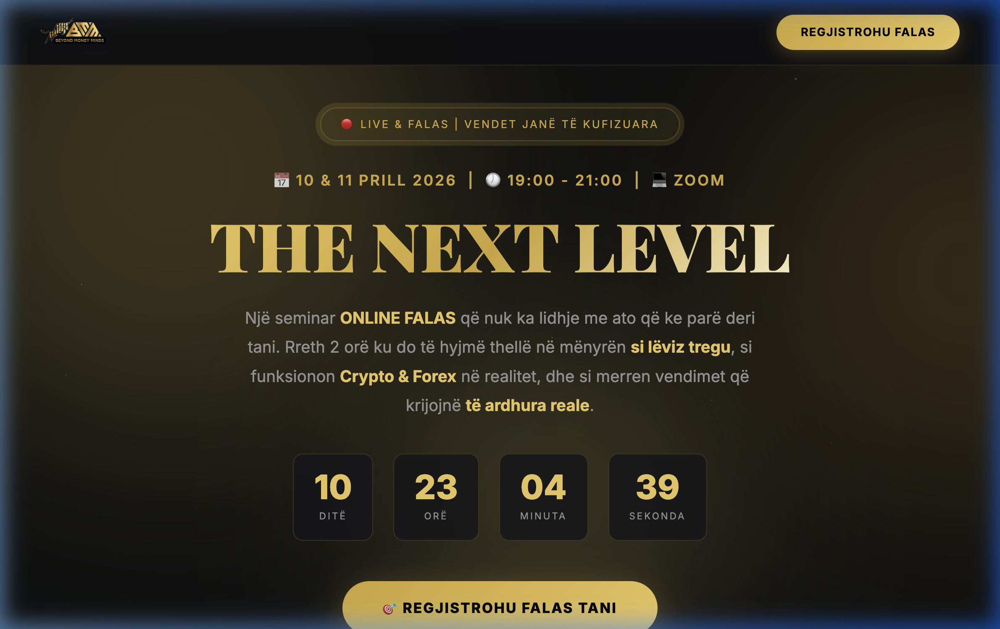

**What it contains:**
- Fixed navigation bar with logo (left) + "REGJISTROHU FALAS" CTA button (right)
- Animated badge: "🔴 Live & Falas | Vendet Janë të Kufizuara"
- Event date/time: 📅 10 & 11 PRILL 2026 | 🕖 19:00 - 21:00 | 💻 ZOOM
- Main title: **"THE NEXT LEVEL"** (gold gradient text, Playfair Display font)
- Description paragraph about the free webinar
- **Live countdown timer** (days, hours, minutes, seconds) counting to April 10, 2026 at 19:00 CET
- Primary CTA button: "🎯 Regjistrohu Falas Tani"
- Subtext: "100% Falas | Vetëm për ata që duan të ndryshojnë"

**Visual effects:** Ambient gold glow orbs (background), floating gold particles, glassmorphism

---

### Section 2: Speakers

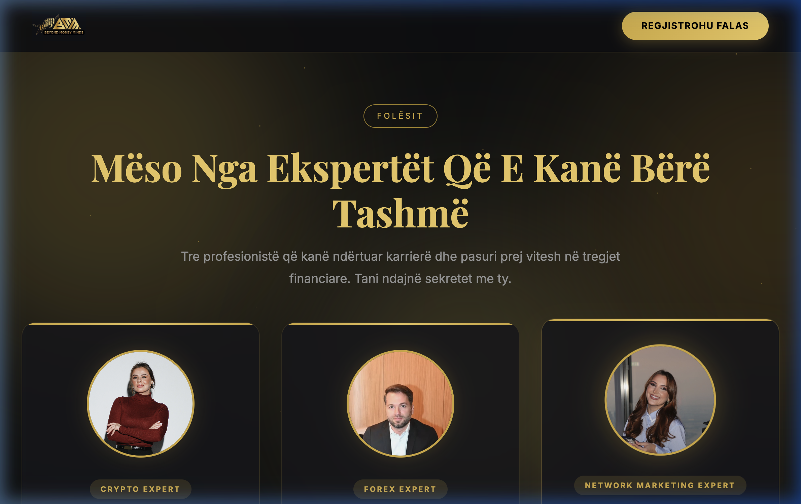

**What it contains:**
- Section tag: "Folësit"
- Title: "Mëso Nga Ekspertët Që E Kanë Bërë Tashmë"
- Subtitle about 3 professionals sharing secrets
- **3 speaker cards** in a row, each with:
  - Circular photo (160px, gold border, glow effect)
  - Tag badge (e.g., "CRYPTO EXPERT")
  - Name (Playfair Display)
  - Role subtitle
  - Bio paragraph
  - Instagram link with 📸 icon

**Speaker 1 — Jori DeFi:**
- Tag: CRYPTO EXPERT
- Role: Crypto & Trading Expert
- Bio: 6+ years crypto experience since 2019, made first million
- Instagram: @jori_defi

**Speaker 2 — Marsid Hila:**
- Tag: FOREX EXPERT
- Role: Forex Trader & Mentor
- Bio: 10+ years in financial markets, trades all markets
- Instagram: @marsid.hila

**Speaker 3 — Elena Demce:**
- Tag: NETWORK MARKETING EXPERT
- Role: Business Mindset & Network Marketing
- Bio: 4 years in network marketing, transforms money mindset
- Instagram: @iamelenademce

---

### Section 3: 2-Day Schedule

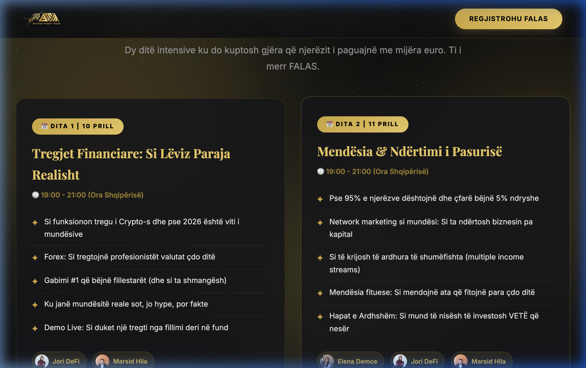

**What it contains:**
- Section tag: "Programi"
- Title: "Çfarë Do Të Mësosh Në 2 Ditë"
- **2 day cards** side by side:

**Day 1 — 10 Prill (Tregjet Financiare: Si Lëviz Paraja Realisht):**
- Time: 19:00 - 21:00
- 5 bullet points about crypto and forex topics
- Speaker chips: Jori DeFi + Marsid Hila (with mini photos)

**Day 2 — 11 Prill (Mendësia & Ndërtimi i Pasurisë):**
- Time: 19:00 - 21:00
- 5 bullet points about mindset, network marketing, multiple income
- Speaker chips: Elena Demce + Jori DeFi + Marsid Hila

---

### Section 4: What You'll Learn (Benefits)

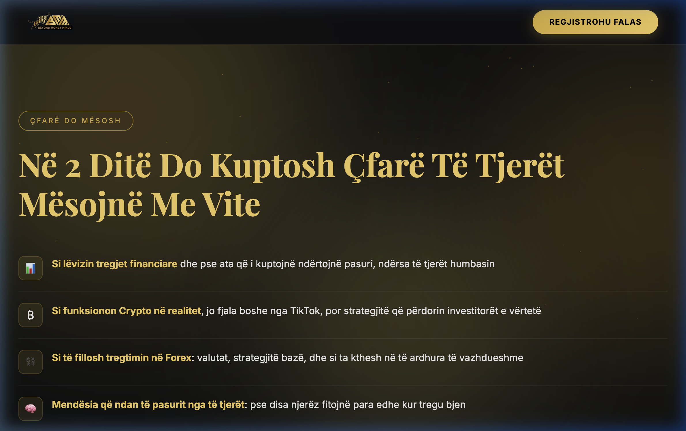

**What it contains:**
- Section tag: "Çfarë Do Mësosh"
- Title: "Në 2 Ditë Do Kuptosh Çfarë Të Tjerët Mësojnë Me Vite"
- **6 benefit items** in a vertical list, each with:
  - Icon box (emoji in a bordered container)
  - Bold title + description text

**Benefits:**
1. 📊 Si lëvizin tregjet financiare
2. ₿ Si funksionon Crypto në realitet
3. 💱 Si të fillosh tregtimin në Forex
4. 🧠 Mendësia që ndan të pasurit nga të tjerët
5. 🚀 Si të ndërtosh të ardhura pa punëdhënës
6. 🎯 Hapat e parë konkretë

---

### Section 5: Motivational Quote

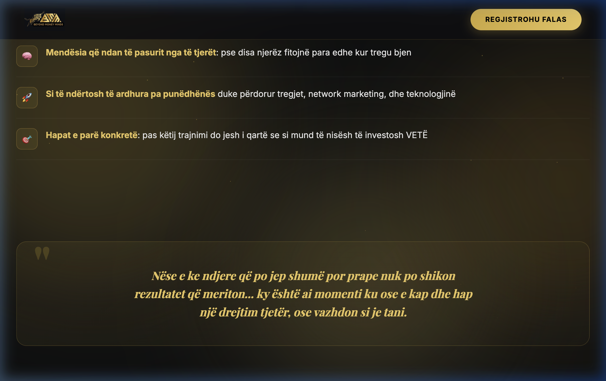

**What it contains:**
- Bordered quote block with gold gradient background
- Large decorative quotation mark
- Italic quote text in Playfair Display
- Quote: "Nëse e ke ndjere që po jep shumë por prape nuk po shikon rezultatet që meriton... ky është ai momenti ku ose e kap dhe hap një drejtim tjetër, ose vazhdon si je tani."

---

### Section 6: Who Is This For (Target Audience)

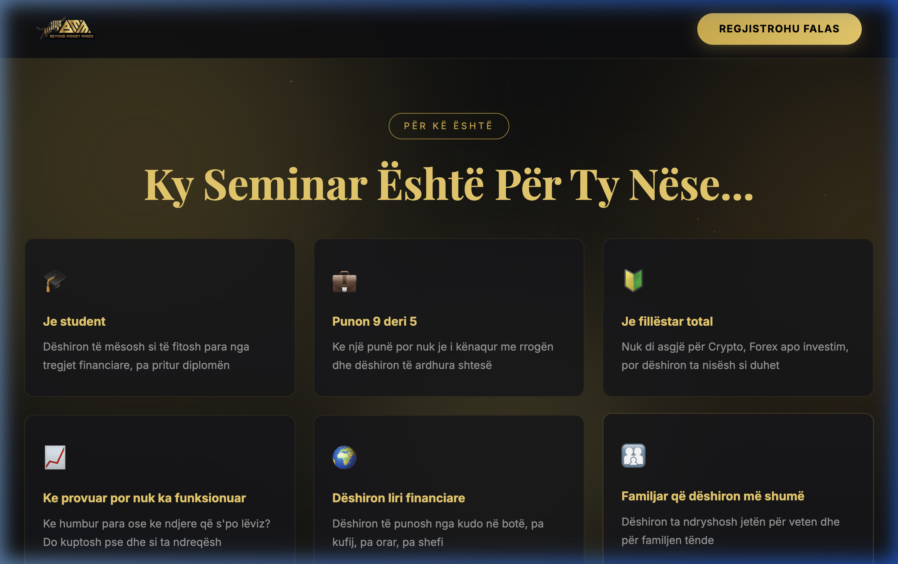

**What it contains:**
- Section tag: "Për Kë Është"
- Title: "Ky Seminar Është Për Ty Nëse..."
- **6 cards in a 3x2 grid**, each with:
  - Emoji icon
  - Bold title
  - Description paragraph

**Cards:**
1. 🎓 Je student
2. 💼 Punon 9 deri 5
3. 🔰 Je fillëstar total
4. 📈 Ke provuar por nuk ka funksionuar
5. 🌍 Dëshiron liri financiare
6. 👨‍👩‍👧 Familjar që dëshiron më shumë

---

### Section 7: Why Now

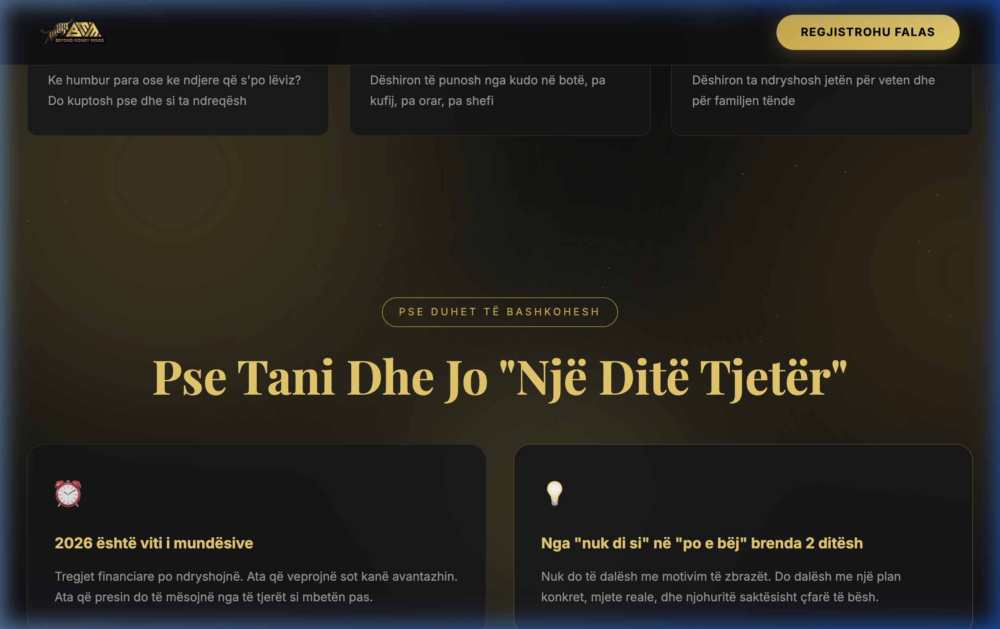

**What it contains:**
- Section tag: "Pse Duhet Të Bashkohesh"
- Title: "Pse Tani Dhe Jo 'Një Ditë Tjetër'"
- **4 cards in a 2x2 grid**, each with:
  - Emoji icon
  - Bold title
  - Description paragraph

**Cards:**
1. ⏰ 2026 është viti i mundësive
2. 💡 Nga "nuk di si" në "po e bëj" brenda 2 ditësh
3. 🎯 Ky seminar nuk do përsëritet kështu
4. 👨‍👩‍👧 Ky vendim ndikon tek e gjithë jeta jote

---

### Section 8: FAQ (Accordion)

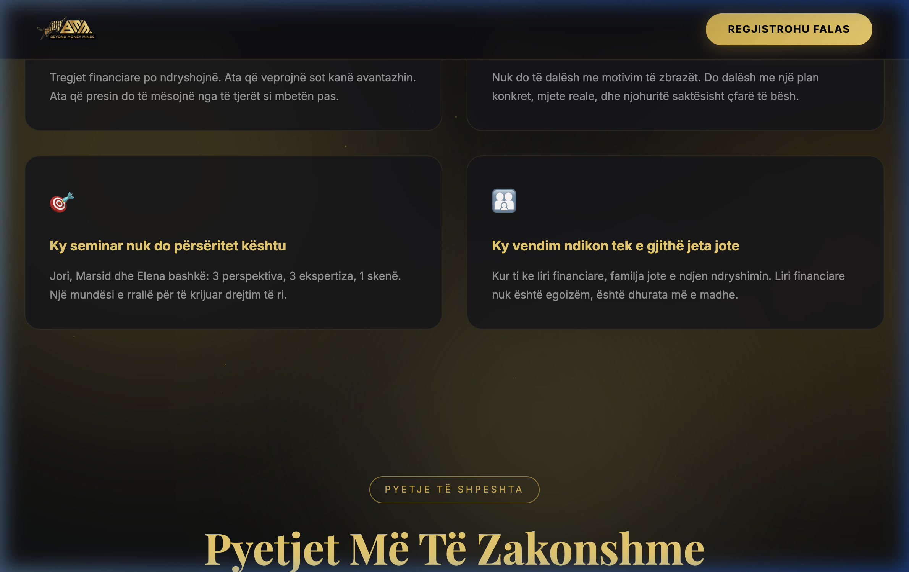

**What it contains:**
- Section tag: "Pyetje të Shpeshta"
- Title: "Pyetjet Më Të Zakonshme"
- **6 interactive accordion items** (click to expand/collapse):
  1. A është vërtetë falas? → Po, 100% falas...
  2. A duhet të kem eksperiencë? → Jo, ndërtuar për fillestarë...
  3. Sa zgjat çdo ditë? → Rreth 2 orë, 19:00-21:00...
  4. A mund ta shoh edhe pas? → Po, do postohet në Whop...
  5. Si regjistrohem? → Kliko butonin, plotëso të dhënat...
  6. A ka kufizim moshe? → Jo, kushdo është i mirëpritur...

---

### Section 9: Final CTA

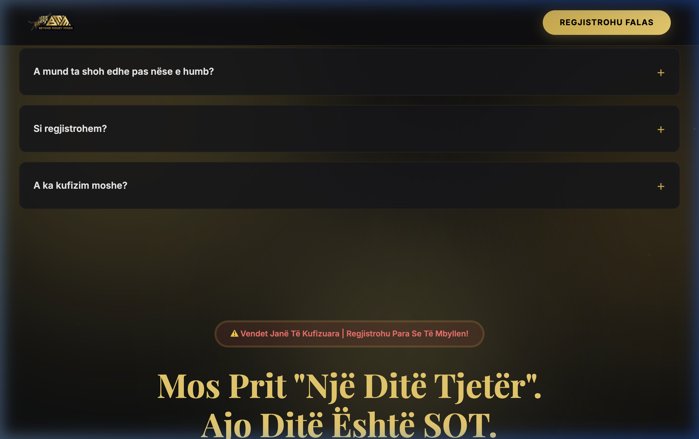

**What it contains:**
- Red urgency badge (pulsing animation): "⚠️ Vendet Janë Të Kufizuara | Regjistrohu Para Se Të Mbyllen!"
- Title: "Mos Prit 'Një Ditë Tjetër'. Ajo Ditë Është SOT."
- Description text about registering free for April 10 & 11
- CTA button: "🚀 PO, DËSHIROJ LIRINË TIME"
- Subtext: "Regjistrimi mbyllet shpejt. Siguro vendin tënd tani"

---

### Section 10: Footer

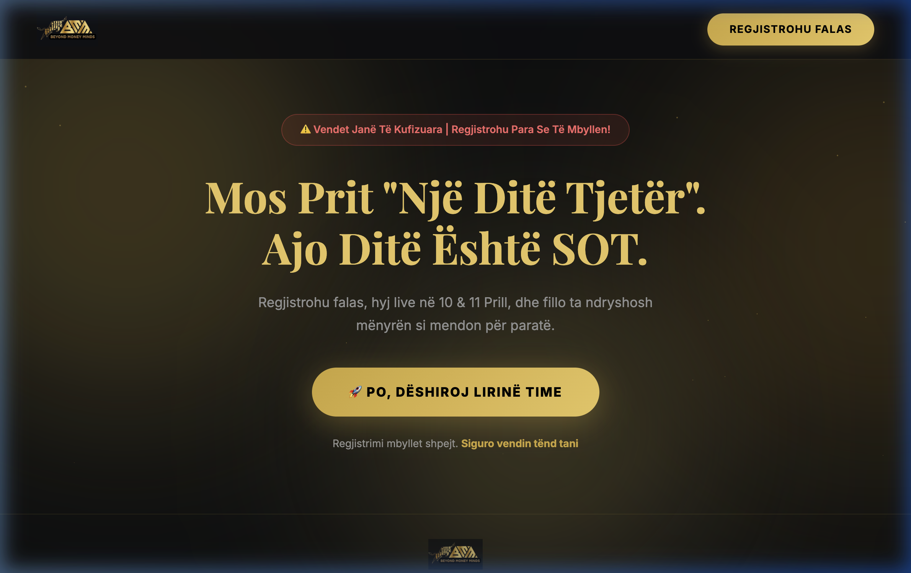

**What it contains:**
- Beyond Money Minds logo (semi-transparent)
- Copyright text: "Powered by Beyond Money Minds | © 2026"
- Subtle gold top border

---

### Section 11: Registration Page (`register.html`)

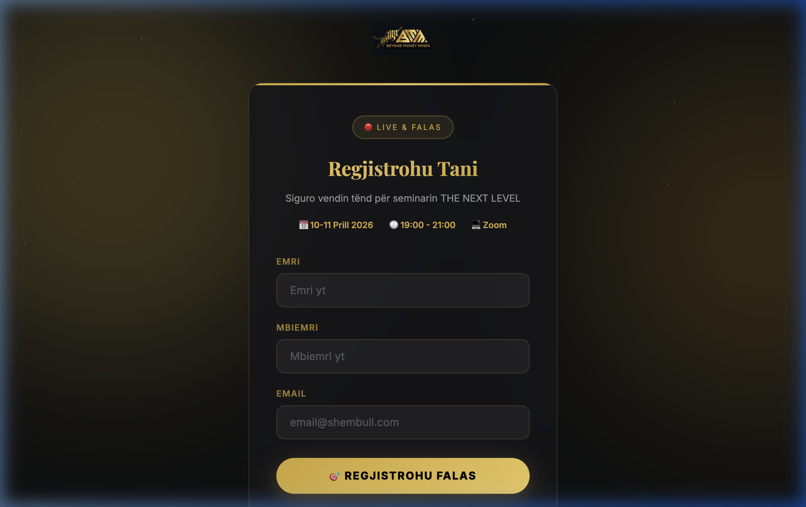

**What it contains:**
- Same black & gold theme as landing page
- Logo at top (links back to index.html)
- Card with gold top border accent
- Badge: "🔴 Live & Falas"
- Title: "Regjistrohu Tani"
- Subtitle + event info (date, time, platform)
- **3 form fields:**
  - Emri (First Name)
  - Mbiemri (Last Name)
  - Email
- Submit button: "🎯 REGJISTROHU FALAS"
- Footer text: "100% Falas | Nuk ka tarifa të fshehura"
- Back link: "← Kthehu tek faqja kryesore"

**After submission:** Shows success screen with 🎉 icon and Zoom join button

---

## 🎨 Design System

### Colors

| Token | Value | Usage |
|---|---|---|
| `--bg` | `#060608` | Page background |
| `--bg-card` | `rgba(15, 15, 20, 0.85)` | Card backgrounds with blur |
| `--gold` | `#d4af37` | Primary accent color |
| `--gold-light` | `#f0d060` | Headings, highlights |
| `--gold-muted` | `#a08520` | Secondary labels |
| `--text` | `#eee` | Body text |
| `--text-muted` | `#999` | Secondary text |
| `--danger` | `#ff4444` | Urgency elements |

### Typography

- **Headings:** `Playfair Display` (serif) — Google Fonts — weights 700, 800, 900
- **Body:** `Inter` (sans-serif) — Google Fonts — weights 300-900

### Visual Effects

- **Glassmorphism:** `backdrop-filter: blur(10-20px)` on cards
- **Ambient Glow:** 3 large blurred gold circles animated in background
- **Gold Particles:** 30 floating dots via JavaScript
- **Card Hover:** `translateY(-5 to -8px)` + glow increase
- **CTA Shimmer:** White sweep animation on hover via `::before`
- **Scroll Animations:** Elements fade up (40px) using IntersectionObserver
- **Countdown:** Updates every second via `setInterval`

---

## ⚙️ Backend — Cloudflare Worker

The registration form sends data to a Cloudflare Worker (`cloudflare-worker.js`).

### Current Worker URL
```
https://bmm.jori-hexalb.workers.dev
```

### API Endpoints

**POST `/register`** — Save registration
```json
// Request
{ "firstName": "Jori", "lastName": "DeFi", "email": "jori@example.com" }
// Response
{ "success": true, "message": "Registered successfully" }
```

**GET `/registrations?key=bmm2026secret`** — Export all (password protected)
```json
{ "total": 42, "registrations": [{ "firstName": "...", "lastName": "...", "email": "...", "registeredAt": "..." }] }
```

**GET `/registrations?key=bmm2026secret&format=csv`** — Download as CSV

### Cloudflare Setup Required
1. Create a **Worker** and paste `cloudflare-worker.js`
2. Create a **KV Namespace** called `BMM_REGISTRATIONS`
3. Bind it as variable name `REGISTRATIONS`
4. Update the `WORKER_URL` in `register.html` (line ~313) with your Worker URL

---

## 🔗 Key Links

| What | URL |
|---|---|
| Zoom Registration | `https://us06web.zoom.us/meeting/register/tAOpGNqTSDCMBLMmdhV7sw` |
| Worker API | `https://bmm.jori-hexalb.workers.dev` |
| Export JSON | `https://bmm.jori-hexalb.workers.dev/registrations?key=bmm2026secret` |
| Export CSV | `https://bmm.jori-hexalb.workers.dev/registrations?key=bmm2026secret&format=csv` |
| Jori Instagram | `https://www.instagram.com/jori_defi` |
| Marsid Instagram | `https://www.instagram.com/marsid.hila` |
| Elena Instagram | `https://www.instagram.com/iamelenademce` |

---

## 📅 Event Details

- **Event:** THE NEXT LEVEL — Free Online Masterclass
- **Dates:** April 10-11, 2026
- **Time:** 19:00 - 21:00 (Albanian time / CET)
- **Platform:** Zoom
- **Language:** Albanian (sq)
- **Price:** Free
- **Recording:** Will be posted on Whop free channel after the event

---

## 🌐 Deployment

### Option 1: Cloudflare Pages (Recommended)
1. Go to Cloudflare Dashboard → Workers & Pages → Create Application
2. Click "Upload your static files"
3. Drag the entire project folder
4. Deploy — get a `.pages.dev` URL

### Option 2: Any Static Hosting
Upload all files (HTML + images) to Netlify, Vercel, GitHub Pages, or any web server. No build step required.

### Option 3: Custom Domain
Deploy to Cloudflare Pages → Settings → Custom Domains → Add your domain.
